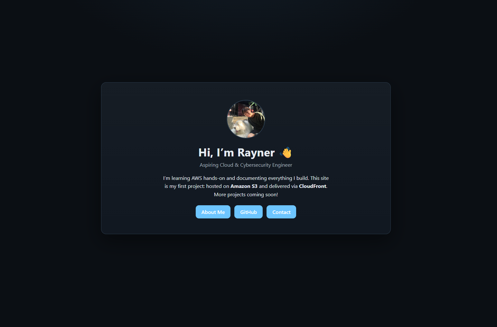

# AWS Static Portfolio Website (S3 + CloudFront)

This project hosts a simple personal portfolio site on **Amazon S3** and delivers it globally using **CloudFront**.

## 🧱 Architecture
S3 (Static Website Hosting) → CloudFront (CDN & HTTPS) → Internet Users

## 🧩 Features
- Responsive centered layout
- Separate About Me page
- Profile image & contact links
- UTF-8 encoding (emoji friendly)
- Ready for CloudFront HTTPS delivery

## ⚙️ AWS Services Used
- **Amazon S3** – static website hosting
- **CloudFront** – CDN + HTTPS
- **IAM** – access control

## 🚀 Deployment Steps
1. Create S3 bucket and upload all files
2. Enable *Static Website Hosting*
3. Add a public read bucket policy
4. Create CloudFront distribution (origin = S3 website endpoint)
5. (Optional) Connect a custom domain via Route 53

## 📸 Live Demo Screenshot

---

### 🧠 Learning Objective
This project demonstrates fundamental AWS skills:
- Hosting & permissions configuration
- Content distribution via CloudFront
- Hands-on experience with IAM & S3 policies

---

**Author:** Rayner Lee  
**GitHub:** [YOUR_GITHUB_USERNAME](https://github.com/jcxl)
